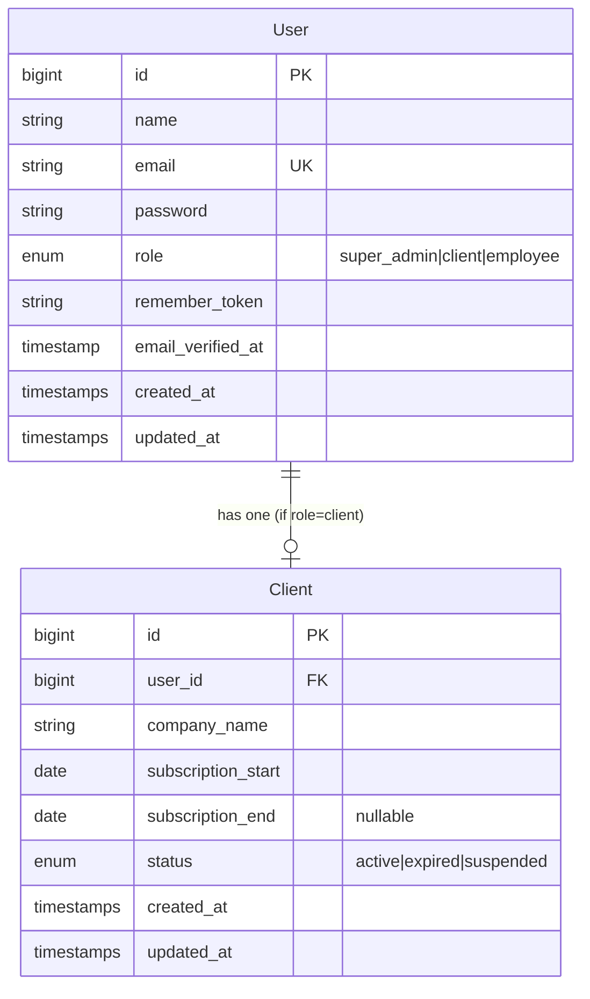
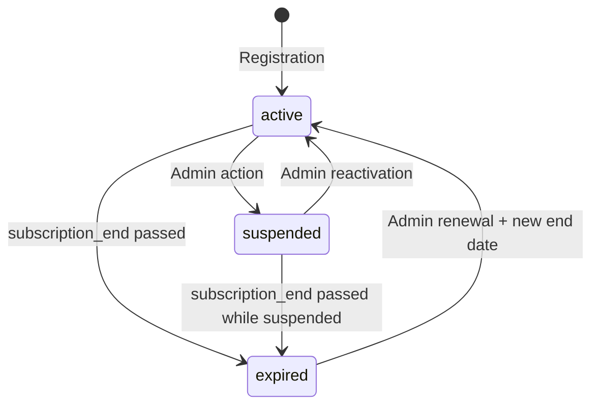

# Data Model: Foundation & Authentication

**Feature**: `001-foundation-auth`
**Date**: 2026-04-04

## Entity Relationship Diagram



## Entity: User (`users` table)

| Field | Type | Constraints | Notes |
|-------|------|-------------|-------|
| `id` | `bigint unsigned` | PK, auto-increment | — |
| `name` | `string(255)` | NOT NULL | Arabic names (UTF-8) |
| `email` | `string(255)` | NOT NULL, UNIQUE | Login identifier |
| `password` | `string(255)` | NOT NULL | bcrypt hashed |
| `role` | `enum` | NOT NULL, values: `super_admin`, `client`, `employee` | Determines route access |
| `remember_token` | `string(100)` | NULLABLE | 30-day remember me |
| `email_verified_at` | `timestamp` | NULLABLE | Reserved for future use |
| `created_at` | `timestamp` | auto | — |
| `updated_at` | `timestamp` | auto | — |

**Validation rules** (registration):
- `name`: required, string, max:255
- `email`: required, email, max:255, unique:users
- `password`: required, string, min:8, confirmed
- `company_name`: required, string, max:255 (used for Client record)

**Validation rules** (login):
- `email`: required, email
- `password`: required, string

**Relationships**:
- `hasOne(Client::class)` — when `role = 'client'`
- `hasOne(Employee::class)` — when `role = 'employee'` (Phase 2+)

**Indexes**:
- UNIQUE on `email`
- INDEX on `role` (for admin queries filtering by role)

## Entity: Client (`clients` table)

| Field | Type | Constraints | Notes |
|-------|------|-------------|-------|
| `id` | `bigint unsigned` | PK, auto-increment | — |
| `user_id` | `bigint unsigned` | FK → users.id, UNIQUE | One client per user |
| `company_name` | `string(255)` | NOT NULL | Arabic company names |
| `subscription_start` | `date` | NOT NULL | Set to today on registration |
| `subscription_end` | `date` | NULLABLE | Super admin sets manually |
| `status` | `enum` | NOT NULL, default: `active`, values: `active`, `expired`, `suspended` | Checked on every request |
| `created_at` | `timestamp` | auto | — |
| `updated_at` | `timestamp` | auto | — |

**Relationships**:
- `belongsTo(User::class)`
- `hasMany(Employee::class)` — via `client_id` (Phase 2+)

**Indexes**:
- UNIQUE on `user_id`
- INDEX on `status` (for admin filtering)

**State transitions**:



**Business rules**:
- A client with `status != 'active'` MUST be redirected to the
  renewal page on every request (middleware enforcement).
- Only `super_admin` can change `status` or set `subscription_end`.
- `subscription_end = NULL` means no expiry date set yet (admin
  must configure).

## Tenant Scoping

The `BelongsToTenant` trait adds a global scope:

```
Applied to: Employee (Phase 2+), and all future tenant-scoped models
NOT applied to: User, Client (these ARE the tenant identifiers)
```

In Phase 1, only `User` and `Client` exist. The trait will be created
now but applied starting Phase 2 when `Employee` is introduced.
