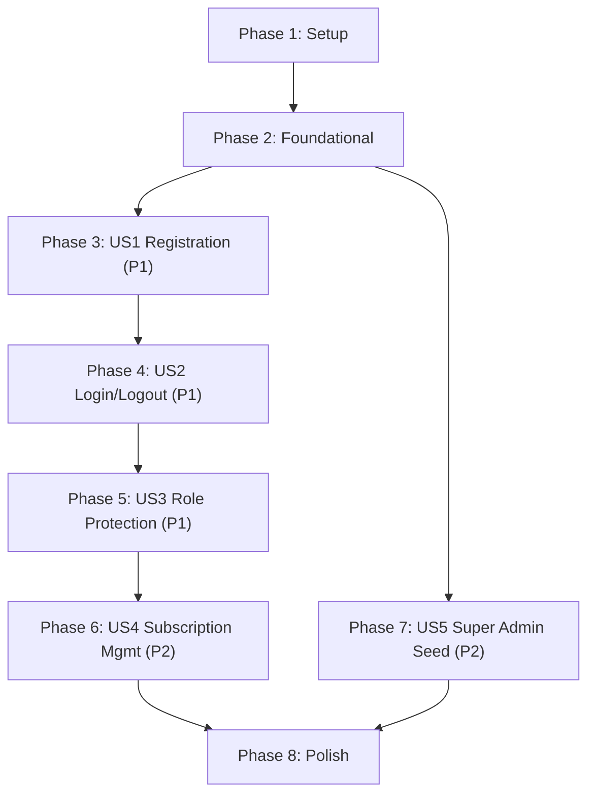

# Tasks: Foundation & Authentication

**Input**: Design documents from `specs/001-foundation-auth/`
**Prerequisites**: plan.md (required), spec.md (required), research.md, data-model.md, contracts/routes.md, quickstart.md

**Tests**: Constitution Principle III mandates TDD. Tests are REQUIRED and MUST be written before implementation.

**Organization**: Tasks grouped by user story for independent implementation and testing.

## Format: `[ID] [P?] [Story] Description`

- **[P]**: Can run in parallel (different files, no dependencies)
- **[Story]**: Which user story (US1–US5)
- Exact file paths included

---

## Phase 1: Setup (Project Initialization)

**Purpose**: Create Laravel project and configure base infrastructure

- [ ] T001 Create Laravel 11 project via `composer create-project laravel/laravel .` in repository root
- [ ] T002 Configure `.env` with MySQL 8 database settings (DB_DATABASE=hr_system, charset=utf8mb4)
- [ ] T003 [P] Set locale to Arabic in `config/app.php` — set `'locale' => 'ar'`, `'fallback_locale' => 'ar'`, `'faker_locale' => 'ar_SA'`
- [ ] T004 [P] Install Laravel Sanctum via `composer require laravel/sanctum` and publish config
- [ ] T005 [P] Create validation messages file at `resources/lang/ar/validation.php` and `resources/lang/en/validation.php` with all standard Laravel validation rules translated
- [ ] T006 [P] Create auth messages file at `resources/lang/ar/auth.php` and `resources/lang/en/auth.php` with login/registration error messages
- [ ] T007 [P] Create custom messages file at `resources/lang/ar/messages.php` and `resources/lang/en/messages.php` with application-specific messages (subscription, roles, etc.)

**Checkpoint**: Laravel project boots with Arabic locale, Sanctum installed, `php artisan serve` works.

---

## Phase 2: Foundational (Blocking Prerequisites)

**Purpose**: Core infrastructure that MUST complete before ANY user story

**⚠️ CRITICAL**: No user story work can begin until this phase is complete

- [ ] T008 Create migration for `users` table in `database/migrations/xxxx_create_users_table.php` — fields: id, name (string 255), email (string 255 unique), password (string 255), role (enum: super_admin/client/employee), remember_token (string 100 nullable), email_verified_at (timestamp nullable), timestamps
- [ ] T009 Create migration for `clients` table in `database/migrations/xxxx_create_clients_table.php` — fields: id, user_id (foreign key → users.id unique), company_name (string 255), subscription_start (date), subscription_end (date nullable), status (enum: active/expired/suspended default active), timestamps. Add index on status column
- [ ] T010 Run `php artisan migrate` to verify both migrations execute cleanly
- [ ] T011 [P] Create `User` model in `app/Models/User.php` — define fillable (name, email, password, role), hidden (password, remember_token), casts (email_verified_at → datetime, password → hashed). Add `hasOne(Client::class)` relationship. Add role check helpers: `isSuperAdmin()`, `isClient()`, `isEmployee()`
- [ ] T012 [P] Create `Client` model in `app/Models/Client.php` — define fillable (user_id, company_name, subscription_start, subscription_end, status), casts (subscription_start → date, subscription_end → date). Add `belongsTo(User::class)` relationship. Add status check helpers: `isActive()`, `isSuspended()`, `isExpired()`
- [ ] T013 [P] Create `BelongsToTenant` trait in `app/Traits/BelongsToTenant.php` — adds global scope filtering by `client_id` resolved from authenticated user. (Will be applied to models starting Phase 2 when Employee is introduced)
- [ ] T014 Create `RoleMiddleware` in `app/Http/Middleware/RoleMiddleware.php` — accepts comma-separated roles parameter, checks `Auth::user()->role` against allowed list, returns 403 error page if unauthorized
- [ ] T015 Create `CheckSubscription` middleware in `app/Http/Middleware/CheckSubscription.php` — runs after auth, checks `Auth::user()->client->status`, redirects to `/subscription/renewal` if status is not 'active'
- [ ] T015.1 Create `LanguageController` in `app/Http/Controllers/LanguageController.php` — sets session `'locale'` and handles redirects for the language switcher
- [ ] T015.2 Create `SetLocale` middleware in `app/Http/Middleware/SetLocale.php` — checks session for `'locale'`, sets `app()->setLocale()` accordingly, defaulting to 'ar'.
- [ ] T016 Register middleware aliases in `bootstrap/app.php` — `role` → `RoleMiddleware`, `check_subscription` → `CheckSubscription`, and append `SetLocale` to the `web` middleware group
- [ ] T017 Create dynamic RTL/LTR base layout in `resources/views/layouts/app.blade.php` — HTML with dynamic `dir` and `lang` based on current locale, meta charset utf-8, CSS logical properties, Alpine.js CDN, bilingual Google Fonts, a visually distinct language switcher button (ar/en), navigation with role-based links, logout form, `@yield('content')` block
- [ ] T018 Create 403 Forbidden error page in `resources/views/errors/403.blade.php` — Translateable message "غير مصرّح لك بالوصول / Unauthorized access" with dynamic layout
- [ ] T019 Configure route files: create `routes/admin.php`, `routes/client.php`, `routes/employee.php`. Load them in `routes/web.php` with appropriate middleware groups: admin (`auth`, `role:super_admin`), client (`auth`, `role:client`, `check_subscription`), employee (`auth`, `role:employee`)
- [ ] T020 Configure progressive rate limiter in `app/Providers/AppServiceProvider.php` — define `login` limiter: 5 attempts per escalating decay (5min → 15min → 30min → 60min), keyed by email + IP

**Checkpoint**: Foundation ready — migrations run, models work, middleware registered, RTL layout renders, route groups configured.

---

## Phase 3: User Story 1 — تسجيل العميل (Client Registration) (Priority: P1) 🎯 MVP

**Goal**: New client registers, user + client records created, redirected to dashboard.

**Independent Test**: Register via form → verify DB records created → verify redirect to `/client/dashboard`.

### Tests for User Story 1 ⚠️

> **TDD: Write tests FIRST, ensure they FAIL before implementation**

- [ ] T021 [P] [US1] Feature test for successful registration in `tests/Feature/Auth/RegistrationTest.php` — POST `/register` with valid data (name, email, password, password_confirmation, company_name) → assert redirect to `/client/dashboard`, assert `users` table has record with role=client, assert `clients` table has record with status=active and subscription_start=today and subscription_end=null
- [ ] T022 [P] [US1] Feature test for duplicate email rejection in `tests/Feature/Auth/RegistrationTest.php` — create existing user, POST `/register` with same email → assert redirect back, assert session has errors for email field, assert no new user created
- [ ] T023 [P] [US1] Feature test for validation errors in `tests/Feature/Auth/RegistrationTest.php` — POST `/register` with empty fields → assert validation errors in Arabic. POST with password < 8 chars → assert validation error. POST with mismatched password_confirmation → assert validation error

### Implementation for User Story 1

- [ ] T024 [US1] Create `RegisterRequest` form request in `app/Http/Requests/RegisterRequest.php` — validate: name (required, string, max:255), email (required, email, max:255, unique:users), password (required, string, min:8, confirmed), company_name (required, string, max:255). Arabic error messages
- [ ] T025 [US1] Create `AuthService` in `app/Services/AuthService.php` — implement `register(array $data): User` method: create user with role=client and hashed password, create Client record with company_name, subscription_start=today, subscription_end=null, status=active. Use DB transaction. Return authenticated user
- [ ] T026 [US1] Create `RegisterController` in `app/Http/Controllers/Auth/RegisterController.php` — `showRegistrationForm()` returns `auth.register` view. `register(RegisterRequest $request)` calls `AuthService::register()`, logs in user, redirects to `/client/dashboard`
- [ ] T027 [US1] Create registration Blade view in `resources/views/auth/register.blade.php` — extends `layouts.app`, Arabic labels, RTL form with fields: الاسم, البريد الإلكتروني, كلمة المرور, تأكيد كلمة المرور, اسم الشركة. Submit button "تسجيل". Display validation errors in Arabic
- [ ] T028 [US1] Create client dashboard placeholder in `resources/views/client/dashboard.blade.php` — extends `layouts.app`, Arabic welcome message "مرحبًا {name}", company name display. Minimal content for now (expanded in Phase 2)
- [ ] T029 [US1] Add registration routes to `routes/web.php` — GET `/register` → `RegisterController@showRegistrationForm`, POST `/register` → `RegisterController@register` (guest middleware)
- [ ] T030 [US1] Run registration tests — verify all 3 test methods pass: `php artisan test --filter=RegistrationTest`

**Checkpoint**: User Story 1 fully functional — client can register and land on dashboard.

---

## Phase 4: User Story 2 — تسجيل الدخول والخروج (Login & Logout) (Priority: P1)

**Goal**: Users login with email/password, get redirected to role-based dashboard, can logout securely.

**Independent Test**: Login with valid credentials → verify role-based redirect. Login with invalid → verify error. Logout → verify session destroyed.

### Tests for User Story 2 ⚠️

> **TDD: Write tests FIRST, ensure they FAIL before implementation**

- [ ] T031 [P] [US2] Feature test for successful login in `tests/Feature/Auth/LoginTest.php` — create user with role=client (active subscription), POST `/login` with correct credentials → assert redirect to `/client/dashboard`. Create user with role=super_admin, login → assert redirect to `/admin/dashboard`. Create user with role=employee, login → assert redirect to `/employee/dashboard`
- [ ] T032 [P] [US2] Feature test for failed login in `tests/Feature/Auth/LoginTest.php` — POST `/login` with wrong password → assert redirect back, assert session has error message in Arabic. POST with non-existent email → assert same behavior
- [ ] T033 [P] [US2] Feature test for logout in `tests/Feature/Auth/LogoutTest.php` — login user, POST `/logout` → assert redirect to `/login`, assert guest (not authenticated), GET `/client/dashboard` → assert redirect to `/login`
- [ ] T034 [P] [US2] Feature test for rate limiting in `tests/Feature/Auth/LoginTest.php` — attempt login 6 times with wrong password → assert 5th attempt succeeds (returns validation error), 6th attempt returns rate limit error with Arabic message and retry-after time
- [ ] T035 [P] [US2] Feature test for remember me in `tests/Feature/Auth/LoginTest.php` — POST `/login` with remember=true → assert remember_token cookie is set

### Implementation for User Story 2

- [ ] T036 [US2] Create `LoginRequest` form request in `app/Http/Requests/LoginRequest.php` — validate: email (required, email), password (required, string). Apply `login` rate limiter. Arabic error messages
- [ ] T037 [US2] Add login/logout methods to `AuthService` in `app/Services/AuthService.php` — `login(string $email, string $password, bool $remember): bool` attempts authentication with remember option, returns success. `logout(): void` invalidates session and regenerates token. Add `getDashboardRoute(User $user): string` that returns role-based redirect URL
- [ ] T038 [US2] Create `LoginController` in `app/Http/Controllers/Auth/LoginController.php` — `showLoginForm()` returns `auth.login` view. `login(LoginRequest $request)` calls `AuthService::login()`, on success redirects to role-based dashboard, on failure redirects back with Arabic error
- [ ] T039 [US2] Create `LogoutController` in `app/Http/Controllers/Auth/LogoutController.php` — `logout(Request $request)` calls `AuthService::logout()`, redirects to `/login`
- [ ] T040 [US2] Create login Blade view in `resources/views/auth/login.blade.php` — extends `layouts.app`, Arabic labels, RTL form with: البريد الإلكتروني, كلمة المرور, checkbox "تذكرني". Submit button "دخول". Display errors in Arabic. Show rate limit message with remaining time if throttled
- [ ] T041 [US2] Create admin dashboard placeholder in `resources/views/admin/dashboard.blade.php` — extends `layouts.app`, Arabic "لوحة تحكم المدير" header. Link to `/admin/clients`
- [ ] T042 [US2] Create employee dashboard placeholder in `resources/views/employee/dashboard.blade.php` — extends `layouts.app`, Arabic "لوحة الموظف" header. Minimal content for now
- [ ] T043 [US2] Add login/logout routes to `routes/web.php` — GET `/login` → `LoginController@showLoginForm` (guest), POST `/login` → `LoginController@login` (guest), POST `/logout` → `LogoutController@logout` (auth). Add dashboard routes to `routes/admin.php`, `routes/client.php`, `routes/employee.php`
- [ ] T044 [US2] Run login/logout tests — verify all pass: `php artisan test --filter=LoginTest` and `php artisan test --filter=LogoutTest`

**Checkpoint**: User Stories 1 AND 2 work — register, login with role-based redirect, logout.

---

## Phase 5: User Story 3 — حماية المسارات (Role-Based Route Protection) (Priority: P1)

**Goal**: Users cannot access routes outside their role. 403 for unauthorized access.

**Independent Test**: Login as each role → attempt to access other role's routes → verify 403.

### Tests for User Story 3 ⚠️

> **TDD: Write tests FIRST, ensure they FAIL before implementation**

- [ ] T045 [P] [US3] Feature test for client accessing admin routes in `tests/Feature/Auth/RoleMiddlewareTest.php` — login as client, GET `/admin/clients` → assert 403 status
- [ ] T046 [P] [US3] Feature test for employee accessing client routes in `tests/Feature/Auth/RoleMiddlewareTest.php` — login as employee, GET `/client/dashboard` → assert 403 status
- [ ] T047 [P] [US3] Feature test for super_admin accessing all routes in `tests/Feature/Auth/RoleMiddlewareTest.php` — login as super_admin, GET `/admin/clients` → assert 200. GET `/client/dashboard` → assert 200 (super_admin has full access)
- [ ] T048 [P] [US3] Feature test for unauthenticated access in `tests/Feature/Auth/RoleMiddlewareTest.php` — as guest, GET `/client/dashboard` → assert redirect to `/login`. GET `/admin/clients` → assert redirect to `/login`

### Implementation for User Story 3

- [ ] T049 [US3] Update `RoleMiddleware` in `app/Http/Middleware/RoleMiddleware.php` — add super_admin bypass: if user role is super_admin, always allow access regardless of required role parameter. This ensures super_admin can access any route in the system
- [ ] T050 [US3] Verify all route groups have correct middleware stacks in `routes/admin.php` (auth + role:super_admin), `routes/client.php` (auth + role:client + check_subscription), `routes/employee.php` (auth + role:employee). Add any missing placeholder routes needed for tests
- [ ] T051 [US3] Run role middleware tests — verify all pass: `php artisan test --filter=RoleMiddlewareTest`

**Checkpoint**: All 3 P1 stories work — registration, login, role-based access control.

---

## Phase 6: User Story 4 — إدارة الاشتراكات (Subscription Management) (Priority: P2)

**Goal**: Super admin views all clients, toggles subscription status. Inactive clients redirected to renewal page.

**Independent Test**: Login as admin → view clients list → change status → login as that client → verify redirect to renewal.

### Tests for User Story 4 ⚠️

> **TDD: Write tests FIRST, ensure they FAIL before implementation**

- [ ] T052 [P] [US4] Feature test for admin clients list in `tests/Feature/Admin/ClientManagementTest.php` — login as super_admin, GET `/admin/clients` → assert 200, assert see company names of all seeded clients. Login as client → GET `/admin/clients` → assert 403
- [ ] T053 [P] [US4] Feature test for status toggle in `tests/Feature/Admin/ClientManagementTest.php` — login as super_admin, PATCH `/admin/clients/{id}/status` with status=suspended → assert client status changed in DB. PATCH with status=active → assert restored
- [ ] T054 [P] [US4] Feature test for subscription end date in `tests/Feature/Admin/ClientManagementTest.php` — login as super_admin, PATCH `/admin/clients/{id}/subscription` with subscription_end=future date → assert date saved in DB
- [ ] T055 [P] [US4] Feature test for subscription check middleware in `tests/Feature/Subscription/SubscriptionCheckTest.php` — create client with status=suspended, login, GET `/client/dashboard` → assert redirect to `/subscription/renewal`. Create client with status=active → assert 200

### Implementation for User Story 4

- [ ] T056 [US4] Create `SubscriptionService` in `app/Services/SubscriptionService.php` — implement `toggleStatus(Client $client, string $status): void` (validates status enum, updates and saves). `setEndDate(Client $client, string $date): void` (validates date is future, updates subscription_end). `isActive(Client $client): bool`
- [ ] T057 [US4] Create `ClientController` in `app/Http/Controllers/Admin/ClientController.php` — `index()` lists all clients with eager-loaded user relationship, returns `admin.clients.index` view. `updateStatus(Request $request, Client $client)` validates status, calls SubscriptionService, redirects back with Arabic success message. `updateSubscription(Request $request, Client $client)` validates date, calls SubscriptionService, redirects back
- [ ] T058 [US4] Create admin clients list view in `resources/views/admin/clients/index.blade.php` — extends `layouts.app`, Arabic table with columns: اسم الشركة, البريد الإلكتروني, حالة الاشتراك (color-coded badge), تاريخ البداية, تاريخ الانتهاء, إجراءات. Status toggle buttons (تعليق/تفعيل). Date picker for subscription_end with Alpine.js
- [ ] T059 [US4] Create subscription renewal page in `resources/views/subscription/renewal.blade.php` — extends `layouts.app`, Arabic informational page: "اشتراكك غير نشط. يرجى التواصل مع الإدارة لتجديد الاشتراك." Displays current status and company info. Logout button
- [ ] T060 [US4] Add admin routes to `routes/admin.php` — GET `/admin/clients` → `ClientController@index`. PATCH `/admin/clients/{client}/status` → `ClientController@updateStatus`. PATCH `/admin/clients/{client}/subscription` → `ClientController@updateSubscription`. Add GET `/subscription/renewal` route (auth only, no role check) in `routes/web.php`
- [ ] T061 [US4] Run subscription tests — verify all pass: `php artisan test --filter=ClientManagementTest` and `php artisan test --filter=SubscriptionCheckTest`

**Checkpoint**: User Stories 1–4 work — full auth flow + admin subscription management.

---

## Phase 7: User Story 5 — تهيئة مدير النظام (Super Admin Seeding) (Priority: P2)

**Goal**: Artisan command seeds a super admin account. Idempotent (no duplicates).

**Independent Test**: Run seeder → verify user exists with role=super_admin. Run again → verify no duplicate.

### Tests for User Story 5 ⚠️

> **TDD: Write tests FIRST, ensure they FAIL before implementation**

- [ ] T062 [P] [US5] Feature test for super admin seeding in `tests/Feature/Admin/SuperAdminSeederTest.php` — run `SuperAdminSeeder` → assert user with email `admin@hr-system.com` exists with role=super_admin. Run seeder again → assert still only 1 super_admin user (no duplicate)

### Implementation for User Story 5

- [ ] T063 [US5] Create `SuperAdminSeeder` in `database/seeders/SuperAdminSeeder.php` — check if super_admin already exists (by role or email), if yes: output Arabic warning "مدير النظام موجود بالفعل" and skip. If no: create user with name="مدير النظام", email="admin@hr-system.com", password=Hash::make('password'), role=super_admin. Output Arabic confirmation "تم إنشاء مدير النظام بنجاح"
- [ ] T064 [US5] Register `SuperAdminSeeder` in `database/seeders/DatabaseSeeder.php` — call SuperAdminSeeder
- [ ] T065 [US5] Run seeder test — verify passes: `php artisan test --filter=SuperAdminSeederTest`

**Checkpoint**: All 5 user stories complete and independently testable.

---

## Phase 8: Polish & Cross-Cutting Concerns

**Purpose**: Final quality pass across all stories

- [ ] T066 Run full test suite via `php artisan test` — fix any failures across all test files
- [ ] T067 [P] Verify cross-tenant isolation: write test in `tests/Feature/Subscription/SubscriptionCheckTest.php` — client A cannot see client B's data in admin panel (super_admin sees all, clients see only their own)
- [ ] T068 [P] Add CSS polish to all Blade views — ensure consistent RTL/LTR styling with logical properties, dual fonts loading correctly, responsive layout for mobile, color-coded subscription status badges
- [ ] T069 [P] Verify all UI strings — scan views to ensure NO hardcoded strings remain. Everything must use `__('...')` and exist in both `ar` and `en` lang files
- [ ] T070 [P] Update `resources/views/layouts/app.blade.php` navigation — role-based nav links: admin sees "العملاء", client sees "لوحة التحكم", employee sees "لوحتي". All roles see "تسجيل خروج"
- [ ] T071 Run quickstart.md verification checklist from `specs/001-foundation-auth/quickstart.md` — manually verify each of the 5 user story checkpoints documented there
- [ ] T072 Git commit all work on branch `001-foundation-auth` with message: `feat(phase-1): foundation & auth — registration, login, roles, subscriptions, super admin seeding`

---

## Dependencies & Execution Order

### Phase Dependencies

- **Setup (Phase 1)**: No dependencies — start immediately
- **Foundational (Phase 2)**: Depends on Setup — BLOCKS all user stories
- **US1 Registration (Phase 3)**: Depends on Foundational
- **US2 Login/Logout (Phase 4)**: Depends on Foundational (can parallel with US1 if needed, but sequential is safer for auth flow)
- **US3 Role Protection (Phase 5)**: Depends on US1 + US2 (needs login working to test role checks)
- **US4 Subscription Mgmt (Phase 6)**: Depends on US2 + US3 (needs admin login + role protection)
- **US5 Super Admin Seed (Phase 7)**: Depends on Foundational only (can parallel with US1–US4)
- **Polish (Phase 8)**: Depends on all user stories complete

### User Story Dependencies



### Parallel Opportunities

```bash
# Phase 1: All setup tasks T003–T007 can run in parallel
# Phase 2: T011, T012, T013 can run in parallel (different model files)
# Phase 3: All US1 tests T021–T023 can run in parallel
# Phase 4: All US2 tests T031–T035 can run in parallel
# Phase 5: All US3 tests T045–T048 can run in parallel
# Phase 6: All US4 tests T052–T055 can run in parallel
# Phase 7: US5 can run in parallel with US1–US4 (independent)
```

---

## Implementation Strategy

### MVP First (User Story 1 Only)

1. Complete Phase 1: Setup
2. Complete Phase 2: Foundational (CRITICAL)
3. Complete Phase 3: User Story 1 (Registration)
4. **STOP and VALIDATE**: Client can register and see dashboard
5. Deploy/demo if ready

### Incremental Delivery

1. Setup + Foundational → Foundation ready
2. Add US1 (Registration) → Test → **MVP!**
3. Add US2 (Login/Logout) → Test → Auth complete
4. Add US3 (Role Protection) → Test → Security layer done
5. Add US4 (Subscription Mgmt) → Test → Business logic complete
6. Add US5 (Super Admin Seed) → Test → Deployment-ready
7. Polish → Production quality

---

## Notes

- [P] tasks = different files, no dependencies
- [Story] label maps task to specific user story
- TDD is MANDATORY per Constitution Principle III
- Verify tests FAIL before implementing
- Commit after each phase or logical group
- All UI must use translation keys `__('messages.xxx')` instead of hardcoded strings
- Stop at any checkpoint to validate story independently
